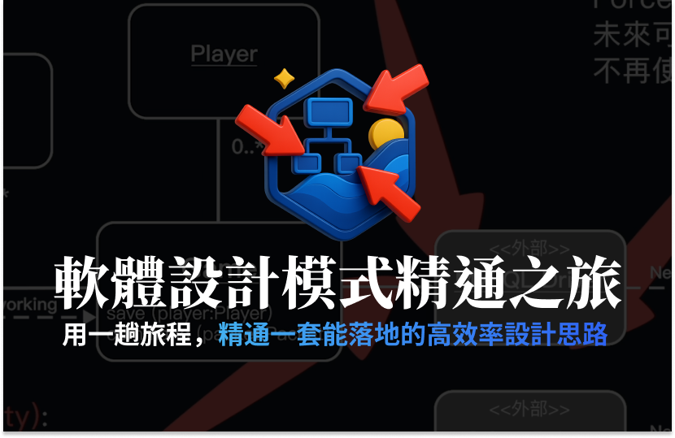

# 水球軟體學院 - 軟體設計模式精通之旅 

本專案是一個 Java 實戰演練 (Dojo) 集合，旨在透過不同的領域場景（如遊戲、系統模擬等）練習物件導向分析與設計 (OOAD)、軟體架構及 Clean Code。



## 專案結構 (Modules)

專案採用 Maven 多模組架構，各模組對應不同的練習課題：

- **[one] Showdown Game**: 撲克牌 Showdown 遊戲實作。
- **[two] Matching**: 配對系統/遊戲練習。
- **[three] Card Framework**: 針對撲克牌類遊戲設計的通用框架。
- **[four] Big Two (步步高升)**: 經典的大老二遊戲邏輯實作。
- **[five] RPG (角色扮演遊戲)**: 包含戰鬥系統、技能（如：鼓舞、一拳超生）與屬性設計。
- **[six] Prescriber (處方系統)**: 醫療處方管理與匯出系統。
- **[seven] HTTP Client**: 基礎 HTTP 用戶端實作練習。
- **[eight] GEMINI Simulator**: 機器人模擬器，包含事件驅動、狀態機 (FSM) 與權限管理。

## 技術棧

- **語言**: Java 21
- **建置工具**: Maven
- **測試框架**: JUnit 5
- **品質管控**:
    - **Spotless**: 自動程式碼格式化。
    - **Checkstyle**: 靜態程式碼分析。
    - **PMD**: 程式碼瑕疵偵測。

## 開發規範 (Coding Standards)

本專案遵循嚴謹的開發流程與規範：

1. **封裝原則**: 所有屬性 (Fields) 必須為 `private`，透過 getter/setter 存取。
2. **命名慣例**: 
    - 類別: `PascalCase`
    - 方法: `camelCase` (動詞開頭)
    - 常數: `UPPER_SNAKE_CASE` (且必須為 `private static final`)
3. **文件註解**: 所有 `public` 方法必須包含 Javadoc。
4. **Clean Code**: 嚴禁 Magic Numbers，應重構為具語意的常數。
5. **最小修改原則**: 在修復或擴充功能時，以通過測試為首要目標，並保持最小程度的架構變動。

## 如何開始

### 格式化程式碼
```bash
mvn spotless:apply
```

### 執行靜態分析
```bash
mvn checkstyle:check
```

### 執行測試
```bash
# 進入各個專案內部
mvn test
```

### 建立專案
```bash
mvn clean install
```

## 文件與設計
各模組的設計文件 (UML) 通常位於該模組下的 `src/uml/` 目錄中，包含 OOA/OOD 圖檔與 `.asta` (Astah) 模型檔。
